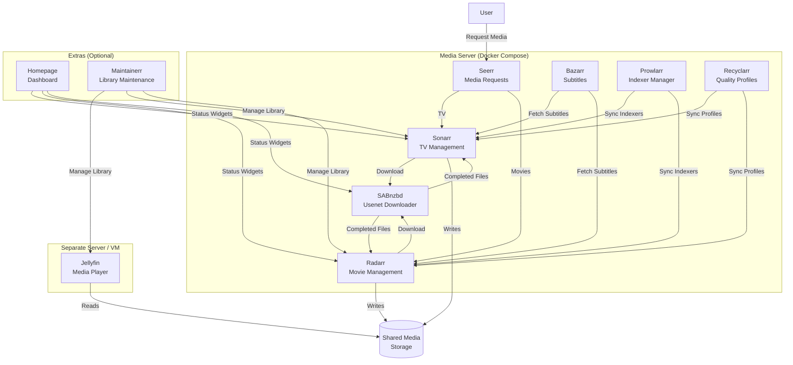

# Docker Media Server

Automated media management stack running on Docker. Handles requesting, downloading, organizing, and subtitling media — with Jellyfin running on a separate server for playback.

## Key Files

- `docker-compose.yml` — core service definitions
- `extras/docker-compose.yml` — optional services (dashboard, library maintenance)
- `.env` / `.env.example` — Docker Compose environment variables (paths, PUID/PGID, timezone)

## Architecture



## Core Services

| Service                                                        | Port | Purpose                                                       |
| -------------------------------------------------------------- | ---- | ------------------------------------------------------------- |
| [Seerr](https://github.com/seerr-team/seerr)                   | 5055 | User-facing request portal for movies and TV                  |
| [Sonarr](https://docs.linuxserver.io/images/docker-sonarr)     | 8989 | TV show management and automation                             |
| [Radarr](https://docs.linuxserver.io/images/docker-radarr)     | 7878 | Movie management and automation                               |
| [SABnzbd](https://docs.linuxserver.io/images/docker-sabnzbd/)  | 8080 | Usenet download client                                        |
| [Bazarr](https://docs.linuxserver.io/images/docker-bazarr)     | 6767 | Automatic subtitle downloading                                |
| [Prowlarr](https://docs.linuxserver.io/images/docker-prowlarr) | 9696 | Centralized indexer management, syncs to Sonarr/Radarr        |
| [Recyclarr](https://recyclarr.dev/guide/installation/docker/)  | —    | Syncs TRaSH quality profiles to Sonarr/Radarr on a daily cron |

## Extras (Optional)

| Service                                    | Port | Purpose                                        |
| ------------------------------------------ | ---- | ---------------------------------------------- |
| [Homepage](https://gethomepage.dev/)       | 3000 | YAML-configured dashboard with service widgets |
| [Maintainerr](https://docs.maintainerr.info/) | 6246 | Automated library maintenance based on rules   |

## Why Run Jellyfin on a Separate Server?

Jellyfin handles real-time transcoding which is CPU/GPU intensive. Running it on a dedicated VM or machine means:

- **Transcoding doesn't starve downloads** — SABnzbd and the *arr apps keep running at full speed during heavy playback.
- **Independent scaling** — give the playback server a GPU or more RAM without over-provisioning the automation stack.
- **Isolation** — a Jellyfin crash or update doesn't take down your download pipeline (and vice versa).

Both servers just need access to the same shared media storage (NFS, SMB, etc.).

## Setup

1. Clone the repo and copy the example env file:

```bash
git clone https://github.com/bcanfield/docker-media-server.git
cd docker-media-server
cp .env.example .env
```

2. Edit `.env` with your values:

```env
TZ=America/New_York      # Your timezone
PUID=1000                 # id $USER
PGID=1000
MEDIA_ROOT=/mnt/media         # Where downloads and organized media live
CONFIG_ROOT=/opt/config-root  # Where app configs are stored
SABNZBD_TEMP=/opt/sabnzbd-temp  # SSD-backed path for SABnzbd temp downloads
```

3. Start the core stack:

```bash
docker compose up -d
```

4. Configure each service through its web UI, wiring them together:
   - Point Sonarr/Radarr to SABnzbd as the download client
   - Point Seerr to Sonarr/Radarr
   - Point Bazarr to Sonarr/Radarr for subtitle fetching

### Extras (Optional)

To run the optional services alongside the core stack:

```bash
cd extras
cp .env.example .env  # edit with your values
cp -r homepage/ ${CONFIG_ROOT}/config/homepage/  # starter dashboard config
docker compose --env-file ../.env --env-file .env up -d
```

The extras compose uses the same `sofa-squad` network as the core stack, so all services can communicate.

## Backups

`extras/backup/` backs up service configs to S3-compatible storage (e.g., DigitalOcean Spaces) using [restic](https://restic.net/). Safely snapshots SQLite databases before backup.

```bash
# Install dependencies
apt install -y restic sqlite3

# Configure
cd extras/backup
cp .env.example .env   # fill in your S3 credentials, restic password, and backup path

# Initialize restic repo (once)
set -a && source .env && set +a
restic init

# Test a backup
./backup-config.sh

# Schedule daily at 3 AM
(crontab -l 2>/dev/null; echo "0 3 * * * $(pwd)/backup-config.sh >> /var/log/restic-backup.log 2>&1") | crontab -
```

Restore:
```bash
cd extras/backup
set -a && source .env && set +a
restic snapshots                             # list snapshots
restic restore latest --target /tmp/restore  # restore latest
```

## Recommended Usenet Indexers

Managed via Prowlarr. Running multiple indexers improves coverage — each has different sources and retention depths. 2-3 indexers is the sweet spot.

| Indexer | Registration | Cost | Strength |
| ------- | ------------ | ---- | -------- |
| [NZBgeek](https://nzbgeek.info/) | Open | ~$12/year | Reliable all-rounder, great for current content |
| [NZBPlanet](https://nzbplanet.net/) | Open (paid) | 8 EUR/year | Largest index (~3M NZBs), strong for older/obscure content |
| [NZBFinder](https://nzbfinder.ws/) | Open | Free tier / ~15-35 EUR/year | Always-open registration, fast indexing, good free tier |
| [DrunkenSlug](https://drunkenslug.com/) | Invite-only | ~10-20 EUR/year | Top-tier quality, watch r/usenet for open registration windows |
| [DOGnzb](https://dognzb.cr/) | Invite-only | $37/year | 4,800+ days retention, IMDb/Trakt watchlist sync |

**Currently using:** NZBgeek, NZBPlanet, NZBFinder

## Resources

- [LinuxServer.io](https://docs.linuxserver.io/) — maintains most of the Docker images used here
- [TRaSH Guides](https://trash-guides.info/) — quality profile recommendations (synced via Recyclarr)
- [Servarr Wiki](https://wiki.servarr.com/) — docs for Sonarr, Radarr, and related apps
