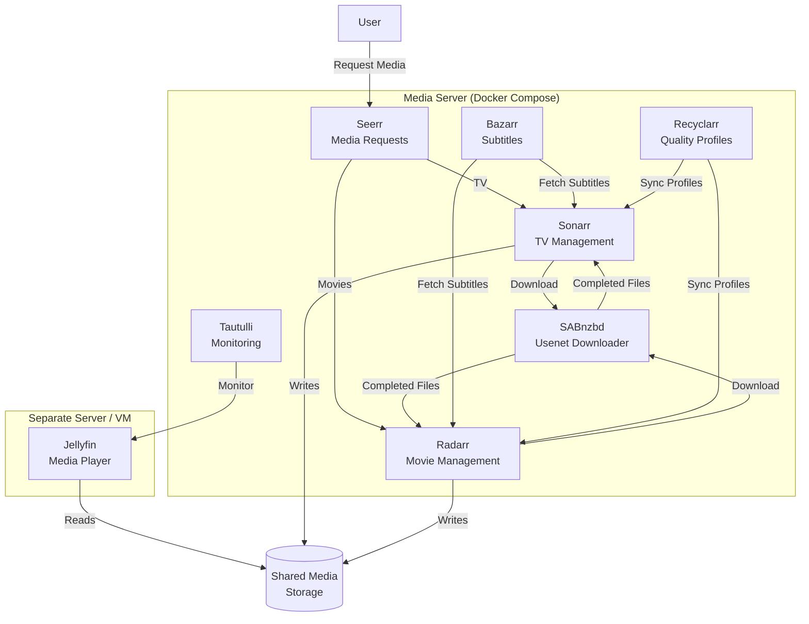

# Docker Media Server

Automated media management stack running on Docker. Handles requesting, downloading, organizing, and subtitling media — with Jellyfin running on a separate server for playback.

## Architecture



## Services

| Service | Port | Purpose |
|---------|------|---------|
| [Seerr](https://github.com/seerr-team/seerr) | 5055 | User-facing request portal for movies and TV |
| [Sonarr](https://docs.linuxserver.io/images/docker-sonarr) | 8989 | TV show management and automation |
| [Radarr](https://docs.linuxserver.io/images/docker-radarr) | 7878 | Movie management and automation |
| [SABnzbd](https://docs.linuxserver.io/images/docker-sabnzbd/) | 8080 | Usenet download client |
| [Bazarr](https://docs.linuxserver.io/images/docker-bazarr) | 6767 | Automatic subtitle downloading |
| [Tautulli](https://docs.linuxserver.io/images/docker-tautulli) | 8181 | Playback monitoring and statistics |
| [Recyclarr](https://recyclarr.dev/guide/installation/docker/) | — | Syncs TRaSH quality profiles to Sonarr/Radarr on a daily cron |

## Why Run Jellyfin on a Separate Server?

Jellyfin handles real-time transcoding which is CPU/GPU intensive. Running it on a dedicated VM or machine means:

- **Transcoding doesn't starve downloads** — SABnzbd and the *arr apps keep running at full speed during heavy playback.
- **Independent scaling** — give the playback server a GPU or more RAM without over-provisioning the automation stack.
- **Isolation** — a Jellyfin crash or update doesn't take down your download pipeline (and vice versa).

Both servers just need access to the same shared media storage (NFS, SMB, etc.).

## Setup

1. Clone the repo and copy the example env file:

```bash
git clone https://github.com/bcanfield/docker-media-server.git
cd docker-media-server
cp .env.example .env
```

2. Edit `.env` with your values:

```env
TZ=America/New_York      # Your timezone
PUID=1000                 # id $USER
PGID=1000
MEDIA_ROOT=/media         # Where downloads and organized media live
CONFIG_ROOT=/mediaconfig  # Where app configs are stored
```

3. Start the stack:

```bash
docker compose up -d
```

4. Configure each service through its web UI, wiring them together:
   - Point Sonarr/Radarr to SABnzbd as the download client
   - Point Seerr to Sonarr/Radarr
   - Point Bazarr to Sonarr/Radarr for subtitle fetching
   - Point Tautulli to your Jellyfin instance

## Resources

- [LinuxServer.io](https://docs.linuxserver.io/) — maintains most of the Docker images used here
- [TRaSH Guides](https://trash-guides.info/) — quality profile recommendations (synced via Recyclarr)
- [Servarr Wiki](https://wiki.servarr.com/) — docs for Sonarr, Radarr, and related apps
