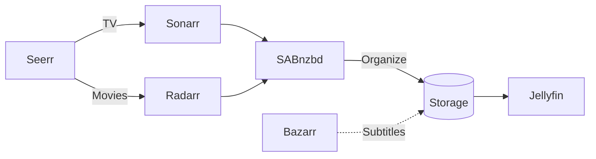

# Docker Media Server

Automated media management stack running on Docker. Handles requesting, downloading, organizing, and subtitling media — with Jellyfin running on a separate server for playback.

## Architecture



## Services

| Service | Port | Purpose | Guide |
| --- | --- | --- | --- |
| [Seerr](https://github.com/seerr-team/seerr) | 5055 | Media request portal | [Wiki](https://github.com/bcanfield/docker-media-server/wiki/Seerr) |
| [Sonarr](https://wiki.servarr.com/sonarr) | 8989 | TV show management | [Wiki](https://github.com/bcanfield/docker-media-server/wiki/Sonarr) |
| [Radarr](https://wiki.servarr.com/radarr) | 7878 | Movie management | [Wiki](https://github.com/bcanfield/docker-media-server/wiki/Radarr) |
| [SABnzbd](https://sabnzbd.org/wiki/) | 8080 | Usenet downloader | [Wiki](https://github.com/bcanfield/docker-media-server/wiki/SABnzbd) |
| [Bazarr](https://wiki.bazarr.media/) | 6767 | Automatic subtitles | [Wiki](https://github.com/bcanfield/docker-media-server/wiki/Bazarr) |
| [Prowlarr](https://wiki.servarr.com/prowlarr) | 9696 | Indexer management | [Wiki](https://github.com/bcanfield/docker-media-server/wiki/Prowlarr) |
| [Recyclarr](https://recyclarr.dev/) | — | TRaSH quality profile sync | [Wiki](https://github.com/bcanfield/docker-media-server/wiki/Recyclarr) |
| [Tailscale](https://tailscale.com/kb/1282/docker) | — | VPN for remote access | [Wiki](https://github.com/bcanfield/docker-media-server/wiki/Tailscale) |

### Extras (Optional)

| Service | Port | Purpose | Guide |
| --- | --- | --- | --- |
| [Homepage](https://gethomepage.dev/) | 3000 | Dashboard with service widgets | [Wiki](https://github.com/bcanfield/docker-media-server/wiki/Homepage) |
| [Maintainerr](https://docs.maintainerr.info/) | 6246 | Automated library maintenance | [Wiki](https://github.com/bcanfield/docker-media-server/wiki/Maintainerr) |
| [LazyLibrarian](https://lazylibrarian.gitlab.io/) | 5299 | Book/audiobook management | [Wiki](https://github.com/bcanfield/docker-media-server/wiki/LazyLibrarian) |
| [Audiobookshelf](https://www.audiobookshelf.org/docs) | 13378 | Audiobook server + mobile apps | [Wiki](https://github.com/bcanfield/docker-media-server/wiki/Audiobookshelf) |

## Quick Start

```bash
git clone https://github.com/bcanfield/docker-media-server.git
cd docker-media-server
cp .env.example .env   # edit with your paths, timezone, and Tailscale key
docker compose up -d
```

Then configure each service through its web UI — see the [wiki](https://github.com/bcanfield/docker-media-server/wiki) for per-service setup guides.

### Extras

```bash
cd extras
cp .env.example .env
cp -r homepage/ ${CONFIG_ROOT}/config/homepage/
docker compose --env-file ../.env --env-file .env up -d
```

## More

- [Tailscale / Remote Access](https://github.com/bcanfield/docker-media-server/wiki/Tailscale)
- [Backups](https://github.com/bcanfield/docker-media-server/wiki/Backups)
- [Usenet Indexers](https://github.com/bcanfield/docker-media-server/wiki/Usenet-Indexers)
- [TRaSH Guides](https://trash-guides.info/) — quality profile recommendations
- [Servarr Wiki](https://wiki.servarr.com/) — Sonarr, Radarr, Prowlarr docs
- [LinuxServer.io](https://docs.linuxserver.io/) — Docker image maintainers
